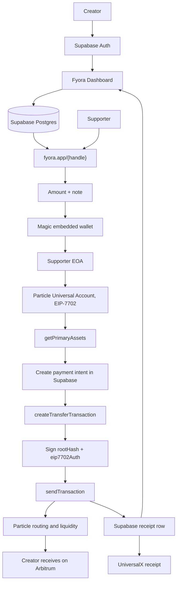

# Fyora PRD

Last updated: 2026-07-10

## Product

**Fyora** is a creator money page for chain-abstracted payments.

Creators get a public page at `https://www.fyora.app/{handle}`. Supporters open the page, choose an amount, sign in through Magic embedded wallets, and pay through Particle Universal Accounts in EIP-7702 mode. The supporter sees one login and one unified balance. Fyora handles chain routing, gas abstraction, and transaction proof. The creator receives their selected token on their selected settlement chain, with Arbitrum as the live demo default.

Brand handles:

- Website: `https://www.fyora.app/`
- X/Twitter: `https://x.com/getfyora`

One-line pitch:

```txt
Fyora lets creators receive money from anyone, on any chain, through one beautiful page.
```

One-line description:

```txt
Fyora is a Linktree-style creator money page where supporters pay from any chain and creators receive on their preferred chain through Particle Universal Accounts.
```

## Hackathon Strategy

### Primary Track: Particle Universal Accounts Track

Submit Fyora to the **Universal Accounts Track**.

Track requirements and Fyora fit:

| Requirement | Fyora response |
|---|---|
| Use Universal Accounts SDK in EIP-7702 mode | Payment flow initializes Particle Universal Account with the supporter EOA and EIP-7702 mode. |
| At least one cross-chain operation moving value via UA | Supporter payment uses `createTransferTransaction()` and `sendTransaction()` to settle to creator on Arbitrum. |
| Functional deployed or runnable demo | Demo is deployed to `https://www.fyora.app/` or runnable locally with documented env vars. |

Judging alignment:

| Criteria | Weight | Fyora strategy |
|---|---:|---|
| UX excellence | 40% | Public creator page, no chain picker, no bridge UI, no gas explanation in the main path. |
| Prominent UA + EIP-7702 use | 30% | Universal Account balance, EIP-7702 authorization, and cross-chain transfer are visible in the payment proof flow. |
| Adoption potential | 20% | Creators already share bio links; Fyora turns that behavior into global crypto receiving. |
| Technical quality and polish | 10% | Supabase-backed production state, explicit transaction proof, narrow MVP, clean error handling. |

### Bonus Targets

**Magic Labs Bonus ($500)**

Use Magic embedded wallets as the main supporter onboarding path. Fyora should feel like a consumer checkout: email or social login, automatic wallet creation, no MetaMask requirement, clear signing states, and polished mobile behavior.

**Arbitrum Bonus ($2,000, if available for this hackathon)**

Use Arbitrum One as the default settlement chain for the live demo. The default settlement token is USDT using the Particle docs example address unless the installed SDK/docs confirm USDC is better for the demo.

Default demo settlement:

```txt
Chain: Arbitrum One
Chain ID: 42161
Token: USDT
Token address: 0xFd086bC7CD5C481DCC9C85ebE478A1C0b69FCbb9
Decimals: 6
```

### Explicit Non-Targets

Do not pursue the General Track unless the UA track becomes impossible. Do not add ZeroDev SRA or Openfort x402 for this MVP. Those tracks dilute the Particle UA story and add integration risk.

## Source Of Truth

Particle docs used:

- Particle Developer Docs: https://developers.particle.network/
- Universal Accounts overview: https://developers.particle.network/universal-accounts/overview
- Universal Accounts web quickstart: https://developers.particle.network/universal-accounts/web-quickstart
- EIP-7702 wallets: https://developers.particle.network/universal-accounts/ua-reference/web/eip7702-wallets
- Transfer transactions: https://developers.particle.network/universal-accounts/ua-reference/web/transactions/transfer
- Send transaction response: https://developers.particle.network/universal-accounts/ua-reference/web/transactions/send-response
- Magic with UA guide: https://developers.particle.network/universal-accounts/how-to/ua-magic

Magic docs used:

- Magic embedded wallets introduction: https://docs.magic.link/embedded-wallets/introduction

Supabase docs used:

- Securing data and frontend keys: https://supabase.com/docs/guides/database/secure-data
- Row Level Security: https://supabase.com/docs/guides/database/postgres/row-level-security
- Edge Functions: https://supabase.com/docs/guides/functions
- Supabase changelog: https://supabase.com/changelog.md

Important implementation facts from docs:

- Particle Universal Accounts provide one account and unified balance across supported chains.
- Particle UA transactions are built with SDK methods such as `createTransferTransaction()` and submitted with `sendTransaction()`.
- Transfer transactions return a `rootHash` that must be signed before broadcast.
- If a transaction includes undelegated `eip7702Auth` entries in `userOps`, Fyora must collect EIP-7702 authorization signatures and pass them to `sendTransaction()`.
- Magic embedded wallets provide low-friction authentication, automatic non-custodial wallet creation, transaction signing, and multi-chain support.
- Supabase publishable keys are acceptable in the frontend only when tables are protected by RLS; secret/service-role keys must stay server-side.
- Supabase changed table exposure behavior in 2026: new tables may not be automatically available through the Data API, so migrations must include explicit grants where browser access is intended.

## Current Repo State

The current `fyora` app is a polished mock MVP:

- TanStack Start/Vite/React app.
- Public creator pages, onboarding, explore, dashboard, editor, QR/share, and OG image route exist.
- Data source is still `src/lib/mock` with persisted Zustand state.
- Payment sheet still uses mocked balances, mocked Magic timing, fake transaction IDs, and local payment insertion.
- No Particle, Magic, or Supabase production SDKs are installed yet.

This PRD defines the required production migration from mock UI to real Magic + Particle + Supabase.

## MVP Scope

### Must Build

- Public creator page at `/{handle}` using the production domain `https://www.fyora.app/{handle}`.
- Creator onboarding with handle, display name, bio, avatar/emoji, links, and settlement settings.
- Creator dashboard with total received, supporter list, settlement config, and UniversalX links.
- Supabase Auth for creator accounts.
- Supabase Postgres as the production source of truth for creators, settlement config, payment intents, and payment receipts.
- Magic embedded wallet flow for supporters.
- Particle Universal Account initialization in EIP-7702 mode.
- Unified balance read before payment.
- Real cross-chain value movement through Particle UA.
- Server-side payment state transitions with transaction proof.
- Demo fallback copy for missing credentials, but no fake paid receipts in production mode.

### Should Build

- QR code and copy-link actions for `https://www.fyora.app/{handle}`.
- X/Twitter profile link to `https://x.com/getfyora` in README/submission collateral.
- Payment note from supporter.
- Mobile-first checkout polish.
- Tiny live-transfer amount preset for judging, for example `$0.10` or `$1`.
- README section explaining the Universal Accounts track, Magic bonus, and Arbitrum bonus.

### Do Not Build

- Subscriptions.
- Marketplace.
- Creator messaging.
- NFT gating.
- Fiat off-ramp.
- Circle Gateway.
- ZeroDev SRA.
- Openfort x402.
- Complex page themes beyond the current polished UI.

## Product Flows

### Creator Flow

1. Creator signs in with Supabase Auth.
2. Creator claims a unique handle.
3. Creator fills display name, bio, emoji/avatar, links, and settlement config.
4. Fyora stores the profile and settlement settings in Supabase.
5. Creator shares `https://www.fyora.app/{handle}`.
6. Creator dashboard displays real payment records from Supabase.

### Supporter Flow

1. Supporter opens a public creator page.
2. Supporter selects amount and optional note.
3. Supporter continues with Magic embedded wallet.
4. Fyora gets the supporter EOA from Magic.
5. Fyora initializes Particle Universal Account for that EOA.
6. Fyora calls `getPrimaryAssets()` and shows unified balance.
7. Fyora creates a payment intent in Supabase.
8. Fyora calls `createTransferTransaction()` to settle to the creator address/token/chain.
9. Supporter signs the `rootHash` and any required EIP-7702 authorization.
10. Fyora calls `sendTransaction()`.
11. Fyora stores `transactionId`, UniversalX URL, token movements if available, and status in Supabase.
12. Supporter sees the receipt and creator dashboard updates from Supabase state.

## Architecture



## Data Model

Use Supabase Postgres as the source of truth. Keep Zustand only for local UI cache/transient state.

### Tables

`profiles`

| Column | Type | Notes |
|---|---|---|
| id | uuid | Primary key, references `auth.users.id`. |
| handle | text | Unique, lowercase, public URL segment. |
| display_name | text | Creator name. |
| bio | text | Optional. |
| avatar_emoji | text | Keep current UI style for MVP. |
| gradient | jsonb | Two-color tuple from existing UI. |
| socials | jsonb | Array of `{ kind, url }`. |
| created_at | timestamptz | Default `now()`. |
| updated_at | timestamptz | Updated on write. |

`settlement_configs`

| Column | Type | Notes |
|---|---|---|
| id | uuid | Primary key. |
| profile_id | uuid | References `profiles.id`, unique. |
| receiver_address | text | Creator wallet address. |
| chain_id | integer | Default `42161`. |
| chain_slug | text | Default `arbitrum`. |
| token_symbol | text | Default `USDT`. |
| token_address | text | Arbitrum token contract. |
| token_decimals | integer | Default `6`. |
| created_at | timestamptz | Default `now()`. |
| updated_at | timestamptz | Updated on write. |

`payment_intents`

| Column | Type | Notes |
|---|---|---|
| id | uuid | Primary key. |
| profile_id | uuid | Creator being supported. |
| supporter_address | text | Magic EOA after connect. |
| supporter_label | text | Optional email/name label, never required publicly. |
| amount_usd | numeric | Human-entered support amount. |
| note | text | Optional public note. |
| status | text | `created`, `wallet_connected`, `submitted`, `confirmed`, `failed`. |
| destination_chain_id | integer | Copied from settlement config at payment time. |
| destination_token_address | text | Copied from settlement config at payment time. |
| transaction_id | text | Particle result ID. |
| universalx_url | text | `https://universalx.app/activity/details?id=...`. |
| error_message | text | Safe user-facing failure reason. |
| raw_result | jsonb | Particle result metadata, no secrets. |
| created_at | timestamptz | Default `now()`. |
| updated_at | timestamptz | Updated on write. |

### RLS Policy Shape

- `profiles`: public `select`; creator-only `insert/update/delete` where `auth.uid() = id`.
- `settlement_configs`: public `select` for active creator pages; creator-only writes through `profile_id`.
- `payment_intents`: public insert only through a constrained server function or server route; public select only for safe fields shown on creator page; creator can select full payment list for their own profile.
- No service-role key in frontend. Use service role only in TanStack server functions or Supabase Edge Functions if a write must bypass public RLS.
- Add explicit `GRANT` statements for `anon` and `authenticated` where Data API access is required, because new Supabase projects may not expose new public tables automatically.

## Environment Variables

Frontend-safe:

```env
VITE_SUPABASE_URL="..."
VITE_SUPABASE_PUBLISHABLE_KEY="..."

VITE_PARTICLE_PROJECT_ID="..."
VITE_PARTICLE_CLIENT_KEY="..."
VITE_PARTICLE_APP_ID="..."

VITE_MAGIC_API_KEY="..."

VITE_FYORA_PUBLIC_URL="https://www.fyora.app"
VITE_FYORA_X_URL="https://x.com/getfyora"
VITE_FYORA_DEFAULT_CHAIN_ID="42161"
VITE_FYORA_DEFAULT_CHAIN_SLUG="arbitrum"
VITE_FYORA_DEFAULT_TOKEN_SYMBOL="USDT"
VITE_FYORA_DEFAULT_TOKEN_ADDRESS="0xFd086bC7CD5C481DCC9C85ebE478A1C0b69FCbb9"
VITE_FYORA_DEFAULT_TOKEN_DECIMALS="6"
```

Server-only:

```env
SUPABASE_SECRET_KEY="..."
SUPABASE_SERVICE_ROLE_KEY="..."
```

Rules:

- Never commit `.env` files.
- Never expose `SUPABASE_SECRET_KEY` or `SUPABASE_SERVICE_ROLE_KEY` to browser code.
- Keep Particle and Magic public client keys in `VITE_` vars only when their docs classify them as browser-safe.

## Implementation Plan

### Phase 1: Production Data Foundation

- Add `@supabase/supabase-js`.
- Add Supabase client helpers for browser and server contexts.
- Add migrations for `profiles`, `settlement_configs`, and `payment_intents`.
- Enable RLS and explicit grants.
- Seed demo creators only through a migration or controlled seed script, not Zustand.
- Replace `src/lib/mock/store.ts` as source of truth; keep a small UI cache if useful.

### Phase 2: Creator Account + Dashboard

- Add Supabase Auth for creators.
- Update `/onboard` to create a real profile and settlement config.
- Update `/dashboard` and `/dashboard/edit` to read/write Supabase data.
- Keep public `/{handle}` readable without login.
- Use `https://www.fyora.app/{handle}` everywhere for QR/copy/share.
- Add `https://x.com/getfyora` to public footer/submission collateral.

### Phase 3: Particle + Magic Payment Flow

- Add `@particle-network/universal-account-sdk`, `magic-sdk`, and `ethers`.
- Add `src/lib/fyora/config.ts`, `particle.ts`, `magic.ts`, `supabase.ts`, and `types.ts`.
- Implement Magic connect and EOA retrieval.
- Initialize Universal Account with Particle project credentials and supporter EOA.
- Read `getPrimaryAssets()`.
- Create Supabase payment intent before signing.
- Build transfer with `createTransferTransaction({ token, amount, receiver })`.
- Sign `rootHash`.
- Collect inline EIP-7702 authorizations from `transaction.userOps` when required.
- Submit with `sendTransaction()`.
- Store transaction proof and UniversalX URL in Supabase.

### Phase 4: Hackathon Polish

- Add clear loading/error states for missing env, Magic cancellation, insufficient unified balance, EIP-7702 decline, Particle failure, and Supabase write failure.
- Add a demo checklist and README update.
- Add a small real-transfer amount for judges.
- Verify mobile checkout and dashboard layout.
- Confirm deployed domain, Supabase Auth redirect URLs, Magic allowed origins, and Particle app domain include `https://www.fyora.app`.

## Acceptance Criteria

For hackathon demo:

- Fyora is deployed at `https://www.fyora.app/` or runs locally with documented env vars.
- Creator can create a page and settlement config stored in Supabase.
- Public page loads by handle without requiring creator login.
- Supporter can log in with Magic embedded wallet.
- App initializes Particle Universal Account in EIP-7702 mode.
- App displays real unified balance from Particle.
- App executes at least one real cross-chain value movement through Particle UA.
- Creator settlement defaults to Arbitrum.
- Receipt shows `transactionId` and UniversalX link.
- Dashboard reads the completed payment from Supabase after refresh.

For production MVP:

- No paid receipt is created unless `sendTransaction()` returns a transaction ID.
- Payment state survives page refresh and different browser sessions.
- RLS prevents creators from editing other creator profiles.
- Secret keys are absent from bundled frontend code.
- Supabase policies and grants are documented in migrations.

## Test Plan

Automated:

- `bun run lint`
- `bun run build`
- Type checks through the existing build.
- Supabase migration lint/advisor check when CLI/project access is available.

Manual:

- Claim a new handle.
- Try claiming an existing handle and confirm uniqueness error.
- Edit settlement address/token and confirm public page reflects it.
- Open `/{handle}` while logged out.
- Attempt payment with missing env and confirm helpful error.
- Connect Magic wallet.
- Load Particle unified balance.
- Attempt payment greater than balance and confirm failure.
- Complete tiny Arbitrum settlement payment.
- Refresh public page and dashboard; verify Supabase persisted the payment.
- Open UniversalX URL from receipt.

Security:

- Confirm `SUPABASE_SERVICE_ROLE_KEY` is not in client bundle.
- Confirm public unauthenticated users cannot update profiles or settlement configs.
- Confirm creator A cannot read private dashboard-only payment fields for creator B.

## Demo Script

1. Open `https://www.fyora.app/`.
2. Claim `fyora.app/maya`.
3. Set settlement to Arbitrum USDT.
4. Open public page in a fresh browser session.
5. Select a small amount.
6. Continue with Magic.
7. Show Particle unified balance.
8. Click pay.
9. Sign root hash and EIP-7702 authorization if shown.
10. Show UniversalX transaction link.
11. Refresh dashboard and show the real payment record from Supabase.
12. Show `https://x.com/getfyora` as the public launch handle.

## Risks And Mitigations

| Risk | Impact | Mitigation |
|---|---|---|
| Magic EIP-7702 signing API differs from Particle example | High | Isolate Magic signing in `magic.ts`; verify against installed SDK and Magic docs before final demo. |
| Particle token support differs from PRD default | High | Verify token constants and supported chains against installed SDK and Particle docs; keep Arbitrum USDT as first demo target. |
| Supabase RLS blocks public profile reads | Medium | Add explicit policies and grants in migrations; test logged-out public page. |
| Payment row is marked confirmed too early | High | Only mark `confirmed` after `sendTransaction()` returns `transactionId`; otherwise keep `failed` or `submitted`. |
| Mainnet funding is hard during demo | Medium | Use tiny transfer amount and pre-fund the Magic/UA account before judging. |
| Domain redirect breaks auth | Medium | Configure Supabase Auth redirects, Magic allowed origins, Particle dashboard app domains, and deployment host for `https://www.fyora.app`. |

## Final Recommendation

Build Fyora as the Universal Accounts Track submission.

The strongest hackathon story is:

```txt
Creator shares one Fyora link.
Supporter logs in with Magic.
Particle Universal Accounts moves value cross-chain in EIP-7702 mode.
Creator receives on Arbitrum.
Supabase stores the production proof.
```

This keeps the MVP focused on the highest-value judging criteria while making the app production-shaped enough to demo confidently.
