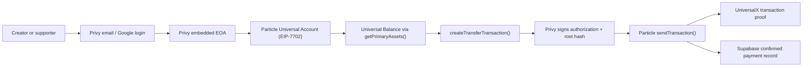
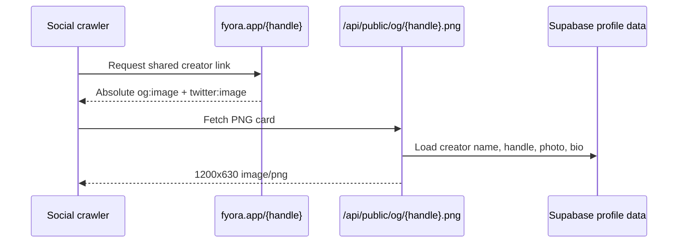

# Fyora

<p align="center">
  <a href="https://www.fyora.app/">
    
  </a>
</p>

Fyora is a creator money page for chain-abstracted support. A creator shares one link, supporters pay from supported assets on any Particle Universal Account chain, and the creator receives on the destination they choose.

- Live app: [fyora.app](https://www.fyora.app/)
- Social: [x.com/getfyora](https://x.com/getfyora)
- Example profile card:

<p align="center">
  
</p>

## What It Does

1. Creators and supporters sign in with Privy email or Google.
2. Privy creates an embedded Ethereum EOA for every user on login.
3. Particle Universal Accounts upgrades that EOA in EIP-7702 mode and reads the Universal Balance.
4. Creators claim `fyora.app/{handle}`, add a bio/photo, and choose a settlement token and chain.
5. Fyora generates a real PNG social card for each handle at `/api/public/og/{handle}.png`.
6. Supporters open the page, choose an amount, and pay without installing MetaMask.
7. Privy signs the EIP-7702 authorization and Particle transaction root.
8. Particle executes the route and Fyora records the confirmed payment in Supabase.

## Stack

- TanStack Start, React, TypeScript, Vite
- Privy Embedded Wallets for login, embedded EOA custody, and signing
- Particle Universal Accounts SDK in EIP-7702 mode
- Supabase Postgres and Storage for production profile/payment data
- Satori and resvg WASM for dynamic PNG social cards
- qrcode.react for share and receive QR codes
- Vercel Analytics

## Wallet Model

Fyora separates wallet concepts clearly:

- **Privy embedded EOA**: the user-owned signing wallet created on login.
- **Universal receive address**: the address shown on `/wallet` for demo deposits and Universal Balance funding. In EIP-7702 mode, this can be the same address as the Privy EOA because the EOA is upgraded in-place.
- **Universal Balance**: read from Particle `getPrimaryAssets()`.
- **Transfers**: built with Particle `createTransferTransaction()` and signed through Privy's EIP-7702 flow.

For demo funding, send a tiny amount of Base USDC and a small amount of Base ETH to the EVM Universal receive address shown on `/wallet`, then refresh the wallet page. If the receive address and signer address match, that is expected in EIP-7702 mode.



## Dynamic Share Cards

Every public profile emits absolute, versioned metadata:

```text
https://www.fyora.app/api/public/og/{handle}.png?v={updatedAt}
```

The card renderer uses Supabase profile data, the creator photo when uploaded, and an emoji/gradient fallback. It returns `image/png` for social crawlers and never returns SVG from a `.png` URL.



## Supabase Data

Supabase stores:

- Privy user id and embedded wallet linkage
- Creator handles, profile text, emoji, gradient, uploaded photo URL
- Settlement chain/token/address
- Payment intents and confirmed transaction receipts

Supabase Auth is not used. Privy remains the authentication and embedded-wallet layer. Protected profile mutations are authorized by validating the Privy access token server-side.

## Local Setup

```bash
npm install
copy .env.example .env.local
npm run dev -- --port 3000
```

Required environment variables:

```env
VITE_FYORA_PUBLIC_URL=http://localhost:3000

VITE_PRIVY_APP_ID=cmrjpk5nm00490cl2w5go8pq4
PRIVY_APP_SECRET=
PRIVY_VERIFICATION_KEY=

VITE_PARTICLE_PROJECT_ID=
VITE_PARTICLE_CLIENT_KEY=
VITE_PARTICLE_APP_ID=

SUPABASE_URL=
SUPABASE_SECRET_KEY=
```

Server-only secrets must not use `VITE_`.

## Database

Apply the Supabase migrations in `supabase/migrations/`.

The latest demo-readiness migration adds:

- `profiles.avatar_url`
- public `creator-avatars` storage bucket

The application uploads creator photos through a Privy-protected server function using the Supabase service key.

## Demo Script

1. Sign in with Privy email or Google.
2. Claim a handle or open an existing profile.
3. Upload a creator photo and save.
4. Copy/share `https://www.fyora.app/{handle}` and verify the link unfurls with the generated card.
5. Open `/wallet`.
6. Copy the EVM Universal receive address.
7. Send a tiny Base USDC amount and enough Base ETH for fees to that address only after explicitly approving the live transfer.
8. Refresh `/wallet` and confirm Particle Universal Balance updates.
9. Open the public profile from another session and send a small support payment.
10. Confirm with Privy, then verify the dashboard metrics count only confirmed payments.

## Commands

```bash
npm run lint
npm run build
```

## Docs

- [Privy React setup](https://docs.privy.io/basics/react/setup)
- [Privy EIP-7702 signing](https://docs.privy.io/recipes/react/eip-7702)
- [Particle Universal Accounts overview](https://developers.particle.network/universal-accounts/cha/overview)
- [Particle UA addresses](https://developers.particle.network/universal-accounts/ua-reference/web/addresses)
- [Particle UA balances](https://developers.particle.network/universal-accounts/ua-reference/web/balances)
- [Particle UA transfers](https://developers.particle.network/universal-accounts/ua-reference/web/transactions/transfer)
- [Particle EIP-7702 wallets](https://developers.particle.network/universal-accounts/ua-reference/web/eip7702-wallets)
