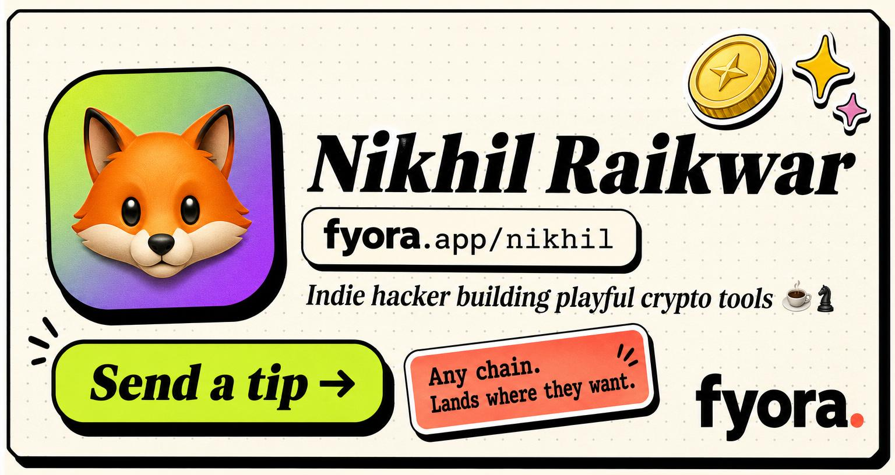
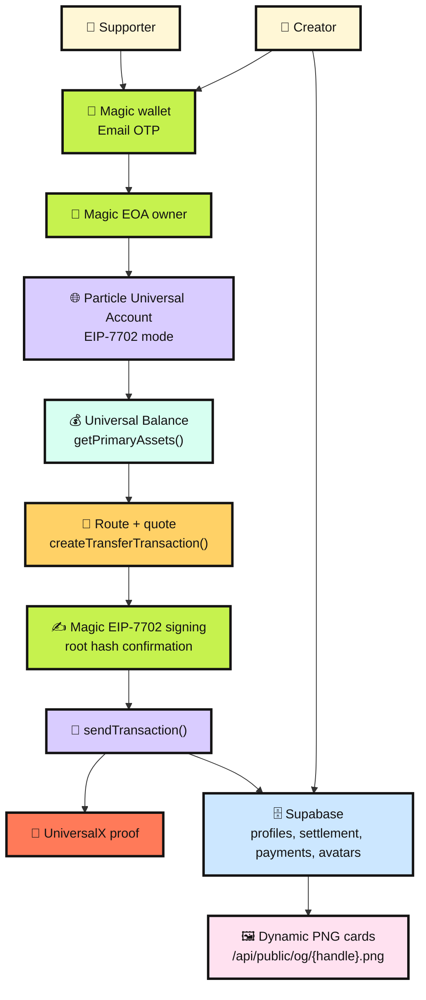
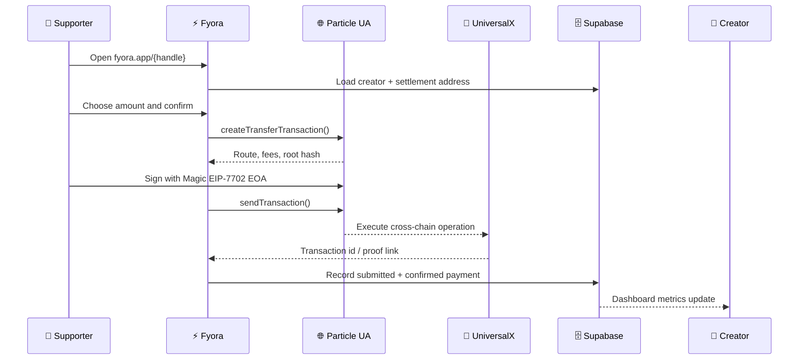

# Fyora

<p align="center">
  <a href="https://www.fyora.app/">
    
  </a>
</p>

**Fyora is a chain-abstracted creator money page.** A creator shares one link, supporters pay from any supported chain through Particle Universal Accounts, and the creator receives on the chain/token they chose.

- Live app: [fyora.app](https://www.fyora.app/)
- Example profile: [fyora.app/nikhil](https://www.fyora.app/nikhil)
- Social: [x.com/getfyora](https://x.com/getfyora)

<p align="center">
  
</p>

## What Fyora Does

1. A creator signs in with a Magic embedded wallet (email OTP).
2. Magic creates a user-owned EOA and acts as the EIP-7702 signer.
3. Particle Universal Accounts upgrades that EOA in place with **EIP-7702**.
4. The creator claims `fyora.app/{handle}`.
5. The creator chooses where funds should land, for example Base USDC or Arbitrum USDC.
6. Fyora stores the creator page, settlement config, avatar, and payments in Supabase.
7. Supporters open the creator link and pay from their Universal Balance.
8. Particle routes the payment across chains and returns UniversalX proof.
9. Fyora verifies and records confirmed payments for dashboard metrics.

## Architecture



## Payment Flow



## Wallet Model

- **Magic EOA owner**: the user-owned wallet created through Magic email login; also the EIP-7702 signer.
- **EIP-7702 Universal Account**: Particle upgrades the Magic EOA in place, so the signer and EVM receive address are the same address.
- **Universal receive address**: the address shown on `/wallet`; direct deposits such as Base USDC can be sent here.
- **Universal Balance**: loaded from Particle `getPrimaryAssets()`.
- **Direct RPC fallback**: Fyora also checks supported EVM chains directly, so fresh deposits can appear while Particle indexing catches up.
- **Transfers**: built with `createTransferTransaction()` and submitted through Particle after user confirmation.

For demo funding, send a small amount of **Base USDC** plus a little **Base ETH** to the EVM Universal receive address shown on `/wallet`. The USDC is the payment amount; ETH gives enough gas/fee room for routing.

## Supported Demo Assets

Fyora’s primary demo assets are aligned with the Particle UA primary asset set used in the app:

- USDC
- USDT
- ETH
- BNB
- SOL

The current production demo is safest with **Base USDC** as the funding asset and **Base or Arbitrum USDC** as the creator settlement target.

## Dynamic Share Cards

Every public profile includes absolute, versioned social metadata:

<p align="center">
  
</p>

```text
https://www.fyora.app/api/public/og/{handle}.png?v={updatedAt}
```

The PNG card renderer uses:

- Supabase profile data
- creator name, handle, bio, gradient, and avatar/photo
- bundled fonts and WASM rendering assets
- `1200x630` PNG output for X, Discord, LinkedIn, WhatsApp, iMessage, and other crawlers

Dashboard also includes a share-card refresh action so creators can update the generated image after profile edits.

## Supabase Data

Supabase is used as the production database, not as the auth provider.

Stored data includes:

- Magic owner UUID, verified owner email, EVM address, and optional Solana address
- creator handles, bios, avatars, gradients, and socials
- settlement chain, token, decimals, and Universal receive address
- payment intents, status, Particle transaction id, UniversalX link, and confirmation data

Server functions validate Magic sessions (DID token) before protected profile or payment operations.

## Tech Stack

- TanStack Start, React, TypeScript, Vite
- Magic embedded wallet (email OTP auth + EIP-7702 signer)
- Particle Universal Accounts SDK
- Supabase Postgres and Storage
- Satori + resvg WASM for PNG cards
- qrcode.react for profile and receive QR codes
- Vercel Analytics

## Environment

```env
VITE_FYORA_PUBLIC_URL=https://www.fyora.app

VITE_PARTICLE_PROJECT_ID=
VITE_PARTICLE_CLIENT_KEY=
VITE_PARTICLE_APP_ID=
VITE_MAGIC_PUBLISHABLE_KEY=
PARTICLE_SERVER_KEY=
PARTICLE_RPC_URL=https://universal-rpc-proxy.particle.network

SUPABASE_URL=
SUPABASE_SECRET_KEY=
MAGIC_SECRET_KEY=

VITE_ETHEREUM_RPC_URL=
VITE_BNB_RPC_URL=
VITE_BASE_RPC_URL=
VITE_ARBITRUM_RPC_URL=
VITE_XLAYER_RPC_URL=
VITE_SOLANA_RPC_URL=
```

Server-only secrets must not use `VITE_`.

## Local Development

```bash
npm install
copy .env.example .env.local
npm run dev -- --port 3000
```

Run checks:

```bash
npm run lint
npm run build
```

## Database Setup

Apply the migrations in `supabase/migrations/`.

Important migrations:

- Core creator, settlement, and payment tables
- Creator avatar storage support
- Particle auth reset and `owner_particle_uuid`
- Particle email ownership metadata for creator recovery and support

## Demo Steps

1. Open [fyora.app](https://www.fyora.app/).
2. Sign in with a Magic email OTP.
3. Claim a creator page.
4. Upload a profile photo and save settlement, preferably Base USDC or Arbitrum USDC.
5. Open `/wallet`.
6. Copy the EVM Universal receive address.
7. Send around `0.20 USDC` on Base and a tiny amount of Base ETH.
8. Refresh `/wallet` and show Universal Balance/direct deposit detection.
9. Open another creator page.
10. Send a tiny support payment, such as `$0.01`.
11. Confirm with the Magic EIP-7702 signer.
12. Open the UniversalX link as proof of the Universal Account operation.

## Particle Docs

- [Particle Developer Docs](https://developers.particle.network/)
- [Universal Accounts Overview](https://developers.particle.network/universal-accounts/cha/overview)
- [Universal Accounts Web Quickstart](https://developers.particle.network/universal-accounts/cha/web-quickstart)
- [Universal Accounts Transfer Reference](https://developers.particle.network/universal-accounts/ua-reference/web/transactions/transfer)
