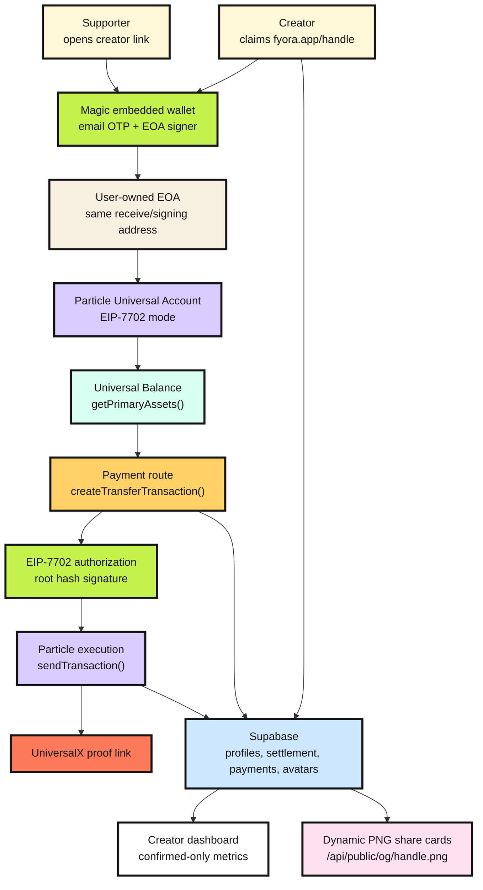
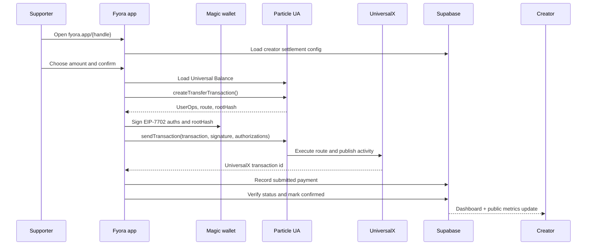

<h1 align="center">Fyora</h1>

<p align="center">
  <a href="https://www.fyora.app/"></a>
  <a href="https://developers.particle.network/"></a>
  <a href="https://docs.magic.link/embedded-wallets/introduction"></a>
  
</p>

<p align="center">
  <a href="https://www.fyora.app/">
    
  </a>
</p>

**Fyora is a creator money page for chain-abstracted payments.** A creator shares one link, supporters pay from a Universal Balance, and Particle Universal Accounts routes value to the creator's chosen settlement chain.

- Live app: [fyora.app](https://www.fyora.app/)
- Example creator: [fyora.app/nikhil](https://www.fyora.app/nikhil)
- Demo proof: [UniversalX transaction 0x0656c14584b419](https://universalx.app/activity/details?id=0x0656c14584b419)

## Problem

Creator payments are still too chain-aware. A supporter may have USDC on Base, a creator may want to receive on Arbitrum, and both sides are usually forced to think about bridges, gas, RPC networks, wallet setup, and token locations before a simple payment can happen.

That friction is especially bad for consumer creators. A creator money page should feel like sharing a normal profile link, not like explaining cross-chain infrastructure to every supporter.

## Solution

Fyora turns creator payments into a single-link experience:

- creators share one Fyora page
- supporters pay from their Universal Balance
- Particle Universal Accounts handles chain abstraction and routing
- Magic embedded wallets provide email-based onboarding and EIP-7702 signing
- creators receive on their configured settlement chain/token
- Supabase records confirmed payments for public stats and dashboard metrics

## Hackathon Tracks

Fyora is built for the **Particle Network Universal Accounts Track**.

- Uses **Particle Universal Accounts SDK** in **EIP-7702 mode**.
- Uses a Magic embedded wallet as the user-owned EOA and EIP-7702 signer.
- Shows one Universal Balance across supported assets.
- Uses `getPrimaryAssets()`, `createTransferTransaction()`, and `sendTransaction()`.
- Produces a real UniversalX proof link after payment execution.

Fyora also applies to the **Magic Labs Bonus Challenge** because onboarding and signing are powered by Magic embedded wallets. Users do not install MetaMask or manage seed phrases for the core Fyora flow.

## What Fyora Does

1. A creator signs in with Magic email OTP.
2. Magic creates and owns the user's embedded EOA.
3. Particle Universal Accounts upgrades that EOA with EIP-7702 behavior.
4. The creator claims `fyora.app/{handle}`.
5. The creator chooses a settlement chain and token, such as Base USDC or Arbitrum USDC.
6. Supporters open the creator link and pay from their Universal Balance.
7. Particle routes the value and returns a UniversalX transaction id.
8. Fyora records the payment in Supabase and updates public profile/dashboard metrics after confirmation.

## Architecture



## Payment Flow



## Wallet Model

Fyora keeps the wallet model simple for users:

- **Magic embedded wallet**: handles passwordless email login and owns the EOA.
- **EIP-7702 signer**: Magic signs EIP-7702 authorizations and the Particle transaction root hash.
- **Particle Universal Account**: turns the EOA into a chain-abstracted account without creating a new visible wallet address.
- **Universal receive address**: the wallet address shown on `/wallet`; users can deposit assets like Base USDC here.
- **Universal Balance**: loaded from Particle `getPrimaryAssets()`.
- **Payments and sends**: built with Particle `createTransferTransaction()` and executed with `sendTransaction()`.

## Real Demo Proof

The working demo transaction is [UniversalX transaction `0x0656c14584b419`](https://universalx.app/activity/details?id=0x0656c14584b419).

It shows:

- status: `Success`
- asset: `USDC`
- transaction id: `0x0656c14584b419`
- from wallet: `0xea...ee3d`
- to wallet: `0xA6...CD9c`
- UniversalX activity with Base and Arbitrum route evidence

That proof is the main demo artifact for the Universal Accounts Track.

## Creator Profiles

Each creator gets:

- public page at `fyora.app/{handle}`
- payment card with preset and custom amounts
- chosen settlement chain/token
- avatar/photo upload
- QR code for sharing
- dynamic social preview image
- dashboard metrics from confirmed payments only
- recent supporters list

## Dynamic Share Cards

Every public profile has absolute, versioned social metadata:

[`https://www.fyora.app/api/public/og/{handle}.png?v={updatedAt}`](https://www.fyora.app/api/public/og/nikhil.png)

The generated card uses Supabase profile data, creator avatar/photo, handle, name, gradient, bundled fonts, and a real `1200x630` PNG renderer for social previews.

<p align="center">
  
</p>

## Data Model

Supabase stores production app data:

- creator profile, handle, bio, socials, gradient, avatar/photo
- Magic owner metadata and EVM address
- settlement chain, token, decimals, and receiver address
- payment intents and idempotency keys
- Particle transaction id and UniversalX URL
- confirmation status used for metrics

Public profile metrics count only confirmed payments. Pending or failed attempts do not inflate totals.

## Tech Stack

- TanStack Start, React, TypeScript, Vite
- Magic embedded wallets for email OTP and EIP-7702 signing
- Particle Universal Accounts SDK for balances, routing, and execution
- Supabase Postgres and Storage
- Satori + resvg WASM for PNG social cards
- qrcode.react for profile and receive QR codes
- Vercel deployment and analytics

## Environment

```env
VITE_FYORA_PUBLIC_URL=https://www.fyora.app

VITE_MAGIC_PUBLISHABLE_KEY=
MAGIC_SECRET_KEY=

VITE_PARTICLE_PROJECT_ID=
VITE_PARTICLE_CLIENT_KEY=
VITE_PARTICLE_APP_ID=
PARTICLE_SERVER_KEY=
PARTICLE_RPC_URL=https://universal-rpc-proxy.particle.network

SUPABASE_URL=
SUPABASE_SECRET_KEY=

VITE_ETHEREUM_RPC_URL=
VITE_BNB_RPC_URL=
VITE_BASE_RPC_URL=
VITE_ARBITRUM_RPC_URL=
VITE_XLAYER_RPC_URL=
VITE_SOLANA_RPC_URL=
```

Server-only secrets must not use the `VITE_` prefix.

## Local Development

```bash
npm install
copy .env.example .env.local
npm run dev -- --port 3000
```

Safe checks:

```bash
npx tsc --noEmit
npm run lint
git diff --check
```

## Useful Links

- [Fyora live app](https://www.fyora.app/)
- [Example Fyora creator page](https://www.fyora.app/nikhil)
- [UniversalX demo proof](https://universalx.app/activity/details?id=0x0656c14584b419)
- [Particle Developer Docs](https://developers.particle.network/)
- [Particle Universal Accounts Overview](https://developers.particle.network/universal-accounts/cha/overview)
- [Particle Universal Accounts Web Quickstart](https://developers.particle.network/universal-accounts/cha/web-quickstart)
- [Particle transfer reference](https://developers.particle.network/universal-accounts/ua-reference/web/transactions/transfer)
- [Magic Embedded Wallets](https://docs.magic.link/embedded-wallets/introduction)

## License

MIT License. Copyright (c) 2026 Nikhil Raikwar.

---

Fyora is built around one simple idea: creators should be able to share one page and receive support without asking supporters to understand chains, bridges, or gas. Particle Universal Accounts handles the chain abstraction, Magic keeps onboarding familiar, and Fyora turns that into a consumer payment experience.
