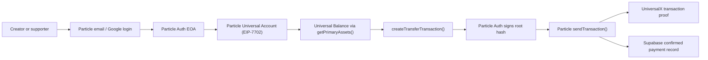
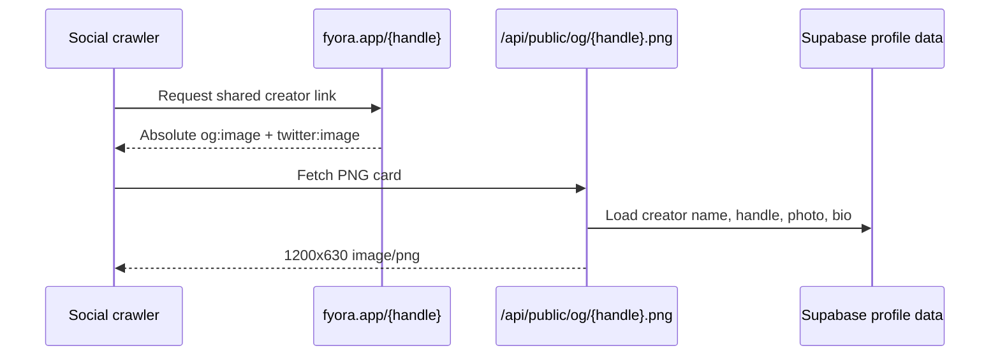

# Fyora

<p align="center">
  <a href="https://www.fyora.app/">
    
  </a>
</p>

Fyora is a creator money page for chain-abstracted support. A creator shares one link, supporters pay from a Particle Universal Balance, and the creator receives on the destination chain and token they choose.

- Live app: [fyora.app](https://www.fyora.app/)
- Social: [x.com/getfyora](https://x.com/getfyora)

<p align="center">
  
</p>

## What It Does

1. Creators and supporters sign in with Particle email or Google.
2. Particle Auth creates the user-owned EOA and wallet session.
3. Particle Universal Accounts upgrades that EOA in EIP-7702 mode.
4. Creators claim `fyora.app/{handle}`, add a bio/photo, and choose settlement.
5. Fyora generates a real PNG social card for each handle at `/api/public/og/{handle}.png`.
6. Supporters choose an amount and pay without manual bridging or chain switching.
7. Particle Auth signs the Universal Account transaction root.
8. Particle executes the route and Fyora records confirmed payments in Supabase.

## Stack

- TanStack Start, React, TypeScript, Vite
- Particle AuthKit for email/Google auth and wallet modal
- Particle Universal Accounts SDK in EIP-7702 mode
- Supabase Postgres and Storage for creator/payment data
- Satori and resvg WASM for dynamic PNG social cards
- qrcode.react for share and receive QR codes
- Vercel Analytics

## Wallet Model

- **Particle Auth EOA**: the user-owned signing wallet created on login.
- **Universal receive address**: the address shown on `/wallet` for demo deposits and Universal Balance funding.
- **Universal Balance**: read from Particle `getPrimaryAssets()`.
- **Transfers**: built with Particle `createTransferTransaction()` and submitted with Particle `sendTransaction()`.

For demo funding, send a tiny amount of Base USDC plus a small amount of Base ETH to the EVM Universal receive address shown on `/wallet`, then refresh. In EIP-7702 mode, the receive address and signer address can be the same EOA because the account is upgraded in place.



## Dynamic Share Cards

Every public profile emits absolute, versioned metadata:

```text
https://www.fyora.app/api/public/og/{handle}.png?v={updatedAt}
```

The card renderer uses Supabase profile data, the creator photo when uploaded, and an emoji/gradient fallback. It returns `image/png` for social crawlers.



## Supabase Data

Supabase stores:

- Particle user UUID and EVM/Solana wallet linkage
- Creator handles, profile text, emoji, gradient, uploaded photo URL
- Settlement chain/token/address
- Payment intents and confirmed transaction receipts

Supabase Auth is not used. Protected profile mutations are authorized by validating the Particle session server-side.

## Local Setup

```bash
npm install
copy .env.example .env.local
npm run dev -- --port 3000
```

Required environment variables:

```env
VITE_FYORA_PUBLIC_URL=http://localhost:3000

VITE_PARTICLE_PROJECT_ID=
VITE_PARTICLE_CLIENT_KEY=
VITE_PARTICLE_APP_ID=
PARTICLE_SERVER_KEY=

SUPABASE_URL=
SUPABASE_SECRET_KEY=
```

Server-only secrets must not use `VITE_`.

## Database

Apply the Supabase migrations in `supabase/migrations/`.

The Particle reset migration:

- Adds `profiles.owner_particle_uuid`.
- Makes the legacy `owner_magic_issuer` nullable for compatibility.
- Clears demo `payments`, `settlement_configs`, and `profiles` rows.
- Keeps creator photo support through the public `creator-avatars` storage bucket.

## Demo Script

1. Sign in with Particle email or Google.
2. Claim a fresh handle such as `nikhil` or `codebreakers`.
3. Upload a creator photo and save.
4. Share `https://www.fyora.app/{handle}` and show the generated PNG preview.
5. Open `/wallet`.
6. Copy the EVM Universal receive address.
7. Fund a tiny amount of Base USDC and Base ETH.
8. Refresh `/wallet` and show Particle Universal Balance.
9. Open a creator page from another session and send a small support payment.
10. Confirm with Particle Auth and open the UniversalX transaction link.

## Commands

```bash
npm run lint
npm run build
```

## Docs

- [Particle Auth Web](https://developers.particle.network/social-logins/auth/desktop-sdks/web)
- [Particle Auth quickstart](https://developers.particle.network/social-logins/auth/quickstart/web-quickstart)
- [Particle wallet widget](https://developers.particle.network/social-logins/configuration/appearance/wallet)
- [Particle Universal Accounts overview](https://developers.particle.network/universal-accounts/cha/overview)
- [Particle UA transfer docs](https://developers.particle.network/universal-accounts/ua-reference/web/transactions/transfer)
