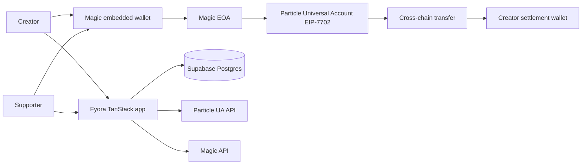

<p align="center">
  <a href="https://www.fyora.app/">
    
  </a>
</p>

<h1 align="center">Fyora</h1>

<p align="center">
  A creator money page powered by Particle Universal Accounts and Magic embedded wallets.
  Supporters pay from a unified multichain balance while creators receive stablecoins on their preferred chain.
</p>

<p align="center">
  <a href="https://www.fyora.app/">Website</a> ·
  <a href="https://x.com/getfyora">X / Twitter</a> ·
  <a href="https://developers.particle.network/universal-accounts/overview">Particle Universal Accounts</a> ·
  <a href="https://docs.magic.link/embedded-wallets/introduction">Magic Embedded Wallets</a>
</p>

## What Fyora Does

Fyora gives every creator a shareable page at `fyora.app/{handle}`. A supporter chooses an amount, signs in with email or Google, and pays without installing a browser wallet. Particle Universal Accounts discovers the supporter's assets across supported chains, creates a chain-abstracted transfer, and settles the creator's selected token on the creator's selected chain.

The creator keeps the same Magic-provisioned EOA. Particle uses EIP-7702 to add Universal Account capabilities to that address in place, without deploying a separate smart account or asking the user to migrate funds.

## Product Flow

1. A creator signs in with Magic using email OTP or Google.
2. Magic provisions embedded EVM and Solana wallet addresses.
3. The creator claims a handle and selects a settlement chain and stablecoin.
4. Fyora publishes a creator payment page.
5. A supporter signs in through Magic and sees their Particle Universal Balance.
6. Particle builds a cross-chain transfer to the creator's configured destination.
7. Magic signs the EIP-7702 authorization and transaction root.
8. Fyora records the intent and confirms the final Particle transaction before marking the payment complete.

## Creator Card

<p align="center">
  
</p>

Fyora uses creator-card artwork for social previews that link directly to the public payment page.

## Architecture



### Particle Universal Accounts

- Universal Accounts SDK `2.0.3`
- Explicit EIP-7702 mode with the Magic EOA as owner
- Unified primary-asset balance
- Cross-chain transfer quotes and execution
- Server-side Particle transaction verification
- No replacement address or separate smart-account deployment

### Magic Embedded Wallets

- Email OTP and Google authentication
- Automatic non-custodial EVM wallet provisioning
- Solana wallet provisioning through the Magic extension
- EIP-7702 authorization and root-hash signing
- No MetaMask or seed phrase required during onboarding

### Supabase

Supabase is the server-only production database for creator profiles, settlement configurations, payment intents, and transaction receipts. Supabase Auth is intentionally not used: Magic is Fyora's identity and wallet layer.

## Supported Settlement Destinations

Fyora exposes stablecoin destinations supported by the Particle SDK's primary-token registry:

| Destination | Tokens |
| --- | --- |
| Ethereum | USDC, USDT |
| BNB Chain | USDC, USDT |
| Base | USDC |
| Arbitrum One | USDC, USDT |
| Solana | USDC, USDT |

Supporters may fund a Particle route with supported assets across their Universal Balance, including native ETH, BNB, and SOL. Creator settlement remains stablecoin-only because Fyora payment amounts are denominated in USD.

## Wallet Access

The address displayed by Fyora comes from the authenticated user's Magic embedded wallet. Funds sent directly to that address are controlled by the user through Magic, not held by Fyora.

Magic's Widget UI can display the connected address, balances, receive controls, and same-chain send controls. Enable **Customization → Widget UI** in the Magic dashboard and expose these SDK methods from the product:

```ts
await magic.wallet.showUI();
await magic.wallet.showBalances();
await magic.wallet.showAddress();
await magic.wallet.showSendTokensUI();
```

Fyora's current MVP retrieves the Magic addresses and uses them for ownership, settlement, and signing. A dedicated in-app wallet and withdrawal screen is planned. Cross-chain withdrawals should use Particle's `createTransferTransaction()` so the same Universal Account routing and Magic signing flow can deliver assets to another address.

## Technology

- TanStack Start, React 19, TypeScript, and Vite
- Particle Universal Accounts SDK
- Magic JavaScript SDK, EVM extension, OAuth extension, and Solana extension
- Supabase Postgres
- ethers v6
- Tailwind CSS and Radix UI
- TanStack Query
- Vercel Web Analytics
- Cloudflare-compatible Nitro server output

## Run Locally

### Requirements

- Node.js 20 or newer
- A Magic embedded-wallet application
- A Particle Network project and web application
- A Supabase project with the Fyora migration applied

### Installation

```bash
git clone https://github.com/NikhilRaikwar/Fyora.git
cd Fyora
npm install
copy .env.example .env.local
npm run dev -- --port 3000
```

Open `http://localhost:3000`.

### Environment

Populate `.env.local` without committing it:

```env
VITE_FYORA_PUBLIC_URL=http://localhost:3000

VITE_MAGIC_PUBLISHABLE_KEY=
VITE_MAGIC_GOOGLE_REDIRECT_URL=http://localhost:3000/auth/callback
MAGIC_SECRET_KEY=

VITE_PARTICLE_PROJECT_ID=
VITE_PARTICLE_CLIENT_KEY=
VITE_PARTICLE_APP_ID=

SUPABASE_URL=
SUPABASE_SECRET_KEY=
```

`MAGIC_SECRET_KEY` and `SUPABASE_SECRET_KEY` are server-only. Never expose them through `VITE_*` variables or commit them to Git.

### Database

The production schema is located at:

```text
supabase/migrations/20260710170000_create_fyora_core.sql
```

Apply it through the Supabase dashboard, CLI, or the configured Supabase integration before creating profiles.

## Demo

1. Sign in through Magic and claim a creator handle.
2. Select a settlement destination such as Arbitrum USDC.
3. Open the public creator page in a separate supporter session.
4. Choose a small support amount.
5. Sign in with Magic and review the real Particle Universal Balance.
6. Confirm the EIP-7702 authorization and payment signature.
7. Wait for Particle verification and open the completed transaction.
8. Return to the creator dashboard to view the recorded payment.

Use a small mainnet amount and fund the Magic-created address before the demo. Particle Universal Accounts currently routes the supported production networks used by this project.

## Security

- TanStack server-function RPC endpoints use same-origin CSRF middleware.
- Magic DID tokens are validated server-side before protected reads or mutations.
- Creator mutations verify the Magic issuer and owner wallet.
- Payment confirmation is based on Particle transaction data, destination, token, and amount.
- Supabase privileged credentials remain server-only.
- `.env.local` and generated output are excluded from Git.

## Project Files

```text
src/lib/fyora/       Magic, Particle, Supabase, settlement, and payment logic
src/routes/          Landing, onboarding, creator, dashboard, and auth routes
src/components/kivo/ Fyora product components
supabase/migrations/ Production database schema
FYORA_PRD.md         Product requirements and implementation checklist
```

## Documentation

- [Particle Universal Accounts overview](https://developers.particle.network/universal-accounts/overview)
- [Particle Universal Accounts web quickstart](https://developers.particle.network/universal-accounts/cha/web-quickstart)
- [Magic embedded wallets](https://docs.magic.link/embedded-wallets/introduction)
- [Magic Widget UI](https://docs.magic.link/embedded-wallets/wallets/customization/widget-ui)
- [Fyora product requirements](./FYORA_PRD.md)
