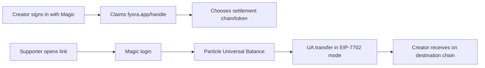

# Fyora Hackathon Submission Notes

## Submission Details

Fyora is a Linktree-style creator money page where supporters can pay from a chain-abstracted balance and creators receive on their preferred destination chain. The app combines Magic embedded wallets for Web2-style onboarding with Particle Network Universal Accounts in EIP-7702 mode for Universal Balance, cross-chain routing, and transaction execution.

During the hackathon, Fyora was moved from a polished mock UI into a production MVP:

- Magic email and Google login for walletless onboarding.
- Magic embedded EOA as the user-owned wallet and signing provider.
- Particle Universal Accounts SDK in EIP-7702 mode.
- Particle Universal Balance through `getPrimaryAssets()`.
- Cross-chain payment and wallet transfer flows through `createTransferTransaction()`.
- Magic EIP-7702 authorization and root-signature flow.
- Supabase production database for creator profiles, settlement settings, and payment records.
- Public creator pages at `fyora.app/{handle}`.
- Dynamic PNG social cards for every creator profile.
- Creator dashboard with confirmed-payment metrics.
- Wallet center showing Magic owner addresses and Particle Universal Account receive addresses.
- Magic Wallet UI button through `magic.wallet.showUI()`.

The main product goal is simple: creators should not need to understand bridges, chains, or gas. They share one link, supporters pay from wherever their assets already are, and the creator receives where they want.

## Track Fit

### Universal Accounts Track

Fyora uses Particle Universal Accounts as the core payment layer.

Required points covered:

- Uses Universal Accounts SDK in EIP-7702 mode.
- Uses Magic as the supported embedded wallet provider for EIP-7702 signing.
- Shows one Universal Balance across primary assets.
- Builds transfer transactions with Particle.
- Includes a cross-chain value movement flow from supporter to creator.
- Demo is deployed at `https://www.fyora.app`.

### Magic Labs Bonus Challenge

Fyora uses Magic for consumer-ready onboarding:

- Email OTP login.
- Google login.
- No MetaMask required.
- Magic embedded wallet owns the user EOA.
- Magic signs EIP-7702 authorization and transaction confirmation.
- In-app wallet button opens Magic Wallet UI with `magic.wallet.showUI()`.

## Links To Submit

Code repository:

```text
https://github.com/NikhilRaikwar/Fyora
```

Live demo:

```text
https://www.fyora.app
```

X / product page:

```text
https://x.com/getfyora
```

Presentation deck:

```text
TODO: paste Google Slides / Canva / PDF link here
```

Demo video:

```text
TODO: paste YouTube / Drive / Loom link here
```

## Demo Video Goal

Keep the video around 3-5 minutes. The video must prove three things clearly:

1. A normal user can sign in without MetaMask using Magic.
2. Fyora is using Particle Universal Accounts in EIP-7702 mode for one Universal Balance and cross-chain routing.
3. A real value movement happens through a Particle Universal Account flow.

## Demo Video Script

### 1. Open With The Problem

Show the landing page.

Voiceover:

```text
Creators today can share links, but crypto payments still force supporters to think about wallets, chains, bridges, gas, and destination networks. Fyora turns that into one creator money page: any chain in, creator's preferred chain out.
```

Show:

- `https://www.fyora.app`
- Main value proposition.
- No wallet-extension requirement.

### 2. Show Creator Onboarding With Magic

Use a creator account.

Show:

- Click sign in.
- Use Magic email or Google login.
- Claim or open an existing creator page.
- Show dashboard.
- Show account dropdown with Wallet.

Voiceover:

```text
Fyora uses Magic embedded wallets for onboarding. The creator gets a wallet through email or Google login, without seed phrases or MetaMask.
```

### 3. Show Creator Profile And Social Card

Show:

- Public page: `https://www.fyora.app/nikhil` or `https://www.fyora.app/codebreakers`.
- Dashboard share QR.
- Automatic share card section.
- Optionally paste the public link into Discord/X preview debugger if already cached correctly.

Voiceover:

```text
Every creator gets a public payment page and a generated PNG card for social previews. The card is built from the creator's profile, photo or emoji, bio, and handle.
```

### 4. Show Wallet Center

Open `/wallet`.

Show:

- “Your wallet is ready.”
- Universal Balance.
- Asset list.
- Receive QR.
- Particle UA receive address.
- Magic owner/signing address.
- Open Magic Wallet button.

Voiceover:

```text
This wallet page separates the Magic owner wallet from the Particle Universal Account receive address. Magic owns the EOA and signing UX. Particle owns Universal Balance and cross-chain routing.
```

Important on-screen line:

```text
Deposit demo funds to the Particle UA receive address, not the Magic owner address.
```

### 5. Funding Step Before Recording The Payment

Do this before recording the final payment flow, or show it quickly if it is already done.

Recommended funding path:

1. Open `https://www.fyora.app/wallet`.
2. Copy the Particle EVM UA receive address.
3. From your own wallet or exchange, send a tiny amount of Base USDC to that Particle UA EVM address.
4. Wait for confirmation.
5. Refresh `/wallet`.
6. Confirm Universal Balance updates.

Recommended amount:

```text
0.05 to 0.20 USDC on Base
```

Avoid sending your full funds. Do not use Ethereum mainnet for the demo because gas is expensive.

Voiceover:

```text
For the demo, I funded the Particle Universal Account receive address with a tiny amount of Base USDC. Particle then exposes it as part of the user's Universal Balance.
```

### 6. Show Cross-Chain Payment To A Creator

Use a supporter session/browser profile different from the creator session if possible.

Show:

- Open a creator page.
- Choose `$0.10` or custom tiny amount.
- Add an optional note.
- Click support.
- Magic login as supporter if not already logged in.
- Show Particle quote / review state.
- Confirm Magic signing.
- Show pending / confirmed state.
- Open UniversalX transaction link.

Voiceover:

```text
The supporter does not pick a bridge. Fyora asks Particle to create the transfer transaction. Particle routes from the Universal Balance, and Magic signs the EIP-7702 authorization and transaction root.
```

Must show if possible:

- Source chain/token balance.
- Destination chain/token chosen by the creator.
- UniversalX transaction link.
- Dashboard updated after confirmation.

### 7. Show Dashboard Metrics

Return to creator dashboard.

Show:

- Total received.
- Supporters count.
- Average tip.
- Top source appears only after confirmed payments.
- Recent payment row with status.

Voiceover:

```text
Fyora only counts confirmed payments in creator metrics. Pending or failed transactions can appear in activity, but they do not inflate creator totals.
```

### 8. Close With Why It Matters

Voiceover:

```text
Fyora makes creator payments feel like a normal consumer app while still using real onchain routing. Magic removes onboarding friction. Particle Universal Accounts provide the one-balance, any-chain execution layer. The creator just shares a link.
```

End screen:

- `https://www.fyora.app`
- `https://github.com/NikhilRaikwar/Fyora`
- `https://x.com/getfyora`

## Exact Funding Checklist

Before making the final demo video:

- Confirm latest deployment includes commit `162de49` or newer.
- Open `/wallet` after Magic login.
- Copy the Particle EVM UA receive address.
- Send tiny Base USDC to that address.
- Wait until Base confirms.
- Refresh `/wallet`.
- Confirm Universal Balance is greater than zero.
- Keep the funding transaction link ready in case the payment transaction takes time.

If the balance does not show:

- Confirm you funded the Particle UA receive address, not the Magic owner address.
- Confirm the token is Base USDC, not bridged/random USDC.
- Wait a few minutes and refresh.
- Try opening UniversalX with the same Magic account to confirm the UA balance.

## Recommended Demo Accounts

Use two accounts if possible:

Creator account:

```text
Owns /nikhil or /codebreakers.
Shows dashboard, settlement setup, wallet receive address, and confirmed incoming payment.
```

Supporter account:

```text
Funded with tiny Base USDC in Particle UA.
Sends payment to creator page.
```

If you only have one account:

```text
Use one browser profile for the creator and another incognito/profile for the supporter. Magic may still map to the same email if reused, so two emails are better.
```

## Presentation Deck Outline

### Slide 1: Fyora

One-line:

```text
Creator money pages powered by Magic onboarding and Particle Universal Accounts.
```

Show:

- Product logo / screenshot.
- `fyora.app`.

### Slide 2: Problem

Creators want support links. Crypto payments still create friction:

- Wallet install.
- Seed phrases.
- Wrong chain.
- Bridges.
- Gas.
- “Which address do I send to?”

### Slide 3: Solution

Fyora gives creators one link:

```text
Any chain in. Creator's chain out.
```

Supporters sign in with Magic and pay from their Particle Universal Balance.

### Slide 4: Product Flow



### Slide 5: Technical Architecture

- TanStack Start frontend.
- Magic embedded wallets for auth and signing.
- Particle Universal Accounts SDK in EIP-7702 mode.
- Supabase for profiles and payment records.
- Satori/resvg for dynamic PNG social cards.

### Slide 6: Particle Integration

Show:

- `getSmartAccountOptions()` for UA receive addresses.
- `getPrimaryAssets()` for Universal Balance.
- `createTransferTransaction()` for payments.
- Magic EIP-7702 signing.

### Slide 7: Magic Integration

Show:

- Email/Google login.
- Embedded wallet ownership.
- No MetaMask.
- `magic.wallet.showUI()`.
- `magic.wallet.sign7702Authorization()`.

### Slide 8: Demo

Add screenshots:

- Public creator page.
- Wallet center.
- Payment confirmation.
- Dashboard metrics.
- UniversalX transaction.

### Slide 9: What Is Working

- Deployed app.
- Creator profiles.
- Magic login.
- Particle UA wallet center.
- Dynamic share cards.
- Supabase-backed payments.
- Cross-chain transfer path.

### Slide 10: Next Steps

- More creator customization.
- More payment assets/chains as Particle expands support.
- Better social sharing analytics.
- Mobile-first polish.
- Creator withdrawals and payment exports.

## Submission Text Short Version

Use this if the submission box is small:

```text
Fyora is a creator money page where supporters can pay from any chain and creators receive on their preferred chain. It uses Magic embedded wallets for email/Google onboarding and wallet ownership, then upgrades the Magic EOA through Particle Universal Accounts in EIP-7702 mode for Universal Balance and cross-chain execution. Creators claim a fyora.app/{handle} page, choose settlement settings, and get an automatic PNG social card. Supporters sign in without MetaMask, review a Particle-powered transfer, confirm through Magic, and Fyora records confirmed payments in Supabase.
```

## Submission Text Full Version

```text
Fyora is a production MVP for creator payments using Particle Universal Accounts and Magic embedded wallets. It gives every creator a public money page at fyora.app/{handle}. Supporters can sign in with Magic email or Google, view their Particle Universal Balance, and send a payment without manually bridging, switching chains, or installing MetaMask.

The core integration uses Particle Universal Accounts SDK in EIP-7702 mode. Magic provides the embedded EOA and signs the EIP-7702 authorization/root signature. Particle provides Universal Balance through getPrimaryAssets(), Universal Account receive addresses through getSmartAccountOptions(), and cross-chain payment execution through createTransferTransaction().

The app is backed by Supabase for creator profiles, settlement configurations, avatar storage, and confirmed payment records. Fyora also generates dynamic PNG social cards for each creator page, so shared links unfurl with branded payment cards.

The demo shows Magic onboarding, Particle Universal Account receive funding, Universal Balance refresh, a real cross-chain payment flow, UniversalX transaction linking, and creator dashboard metrics based only on confirmed payments.
```

## Final Submission Checklist

- Code repository link added.
- Live demo link added.
- Presentation deck link added.
- Demo video link added.
- Project image uploaded.
- Magic Labs Bonus Challenge selected.
- Universal Accounts Track selected.
- Demo shows EIP-7702 / Universal Accounts clearly.
- Demo shows at least one real cross-chain value movement.
- Demo shows Magic login / embedded wallet UX.
- No private keys or secret env vars shown in the video.
- Only tiny mainnet amounts used.
